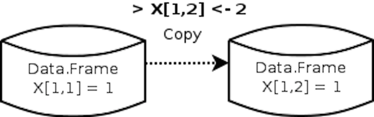
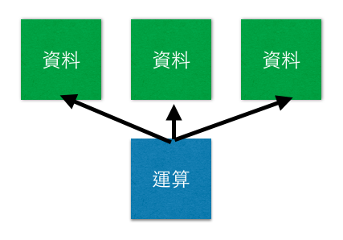
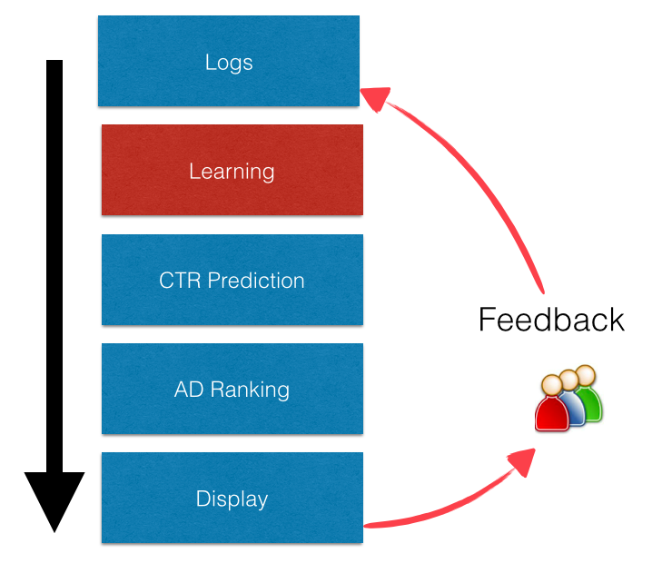
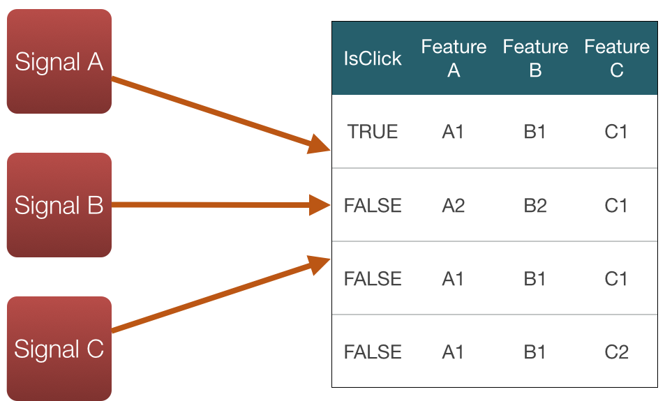
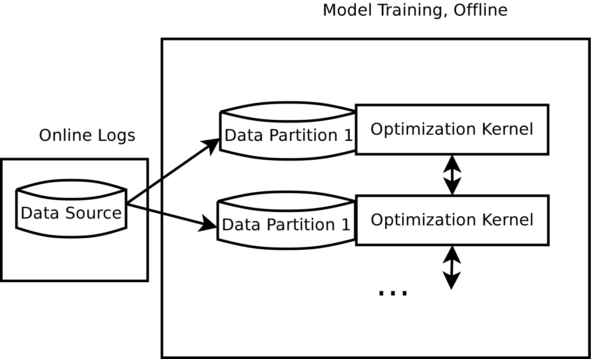

### 解讀`profile1.out`

```{r, eval=FALSE}
summaryRprof("profile1.out", lines = "show")$by.self
```

```{r, echo=FALSE, results='asis'}
print(xtable(summaryRprof("profile1.out", lines = "show")$by.self), type="html")
```

--- &twocol

## 怎麼知道記憶體不夠了？

### 查詢物件的記憶體用量

```{r}
object.size(iris)
```

### 利用作業系統的工具查R 的記憶體用量

- Windows : Ctrl + Alt + Delete
- Linux : htop

--- &vcenter


--- &vcenter .large

物件的複製

Copy On Write



--- &vcenter .large

利用`tracemem`指令可以追蹤物件的複製

--- &twocol

## `data.table`、`tracemem`使用範例

*** =left

```{r tracemem.data.table}
library(data.table)
data(mtcars)
tracemem(mtcars)
set(mtcars, j="mpg", 
    value=NULL)
```

*** =right

```{r tracemem.data.frame, dependson="tracemem.data.table"}
tracemem(mtcars)
mtcars[, "mpg"] <- NULL
```

--- &twocol

## Rcpp的Modify In Place範例

*** =left

```{r rcpp_tracemem, engine='Rcpp', results='hold', cache=TRUE}
#include <Rcpp.h>

using namespace Rcpp;

//[[Rcpp::export]] 
SEXP fill(NumericVector v, double value) {
  v.fill(value);
  return v;
} 
```

*** =right

```{r rcpp_tracemem_r, dependson="rcpp_tracemem", cache=TRUE}
a <- numeric(100)
tracemem(a) 
invisible(fill(a, 1.0))
head(a)
a[] <- 2
head(a)
```

--- &twocol

## 記憶體不夠怎麼辦？

- 買記憶體或買新電腦吧！（四萬塊可以買到64G）
- 使用資料庫系統，更有效率的使用硬碟
- 使用更有效率的資料結構：
    - 矩陣大部分是0 的時候，使用Matrix套件的Sparse Matrix結構
    - 大量重復的字串資料，可試著使用factor物件來節省記憶體

*** =left

```{r mem1}
library(Matrix); data(KNex)
class(KNex$mm)[1]
object.size(KNex$mm)
```

*** =right

```{r mem2, dependson="mem1"}
mm <- as(KNex$mm, "matrix")
class(mm)
object.size(mm)
```

--- &vcenter .large

加快運算速度

--- &vcenter .large

改善的方法

### 利用compiler::cmpfun來將函數編譯成byte code
### 使用別人寫好的高效能套件
### 使用parallel套件來運用CPU的多核心
### 使用Rcpp套件來快速開發C++程式提升效能
### 使用更快的BLAS套件

--- 

## Compiler 效能比較

```{r compiler, cache = TRUE}
library(compiler)
f <- function(n, x=1) for (i in 1:n) x=1/(1+x)
lf <- cmpfun(f)
N <- 1e6
library(rbenchmark)
benchmark(
  f(N, 1),
  lf(N, 1)
  )
```

--- &vcenter .large

包成套件後，預設會使用byte code

### DESCRIPTION: ByteCompile

--- &vcenter .large

R's BLAS v.s. Apple's BLAS (可參考[RMacOSX-FAQ](http://r.research.att.com/man/RMacOSX-FAQ.html#Which-BLAS-is-used-and-how-can-it-be-changed_003f))

```{r, echo=FALSE, results='asis'}
blas <- read.csv(file="blas.csv", check.names = FALSE, as.is = TRUE)
blas <- data.frame(lapply(blas, as.character), stringsAsFactors = FALSE)
for(i in c(4, 5, 8, 9, 10)) {
  blas$Apple.s.BLAS[i] <- sprintf("<font color='red'>%s</font>", blas$Apple.s.BLAS[i])
}
print(xtable(blas), type="html", sanitize.text.function = function(s) {s})
```

--- &vcenter .large

Parallel & Bootstrap

```{r parallel-bootstrap, cache = FALSE, echo=FALSE, eval=FALSE}
# THe code is run on my desktop
X <- matrix(rnorm(3000 * 300), 3000, 300)
w <- rnorm(300, 1, 0.1)
y <- X %*% w + rexp(300, 1) - 1
df <- data.frame(X)
df$y <- y
library(boot)
f <- function(df, i) {
  df.sampled <- df[i,]
  lm(y ~ ., df.sampled)$coef[1]
}
benchmark(replications=4,
  boot(df, f, R=100, parallel="multicore"),
  boot(df, f, R=100, parallel="no")
  )
```

```
boot(df, f, R = 100, parallel = "multicore", ncpus = 4)
2                   boot(df, f, R = 100, parallel = "no")
  replications elapsed relative user.self sys.self user.child
1           20 311.831    1.000     6.388    0.560    876.979
2           20 622.117    1.995   620.335    0.112      0.000
  sys.child
1      5.26
2      0.00
```

--- &vcenter .large

改善資料讀取的速度

--- &vcenter .large

加強資料讀取的效能

### 儲存成壓縮格式（把硬碟讀取時間變成CPU的時間）
### SSD
### 分散式讀取

--- &vcenter .large

Spark 


--- &vcenter .large

Single Machine

```
2014-04-17 19:20:02 INFO::Table 201404071810 is existed
2014-04-17 19:20:02 INFO::Table 201404071850 is existed
...
2014-04-17 19:21:37 INFO::parsing 047/20140417/ExposeLog201404171720.txt ...
2014-04-17 19:21:40 INFO::parsing 025/20140417/ExposeLog201404171720.txt ...
2
...
2014-04-17 19:27:22 INFO::parsing 017/PersonLog201404171730.txt
2014-04-17 19:27:46 INFO::parsing 017/PersonLog201404171730.txt
...
2014-04-17 19:46:14 INFO::{
    "ETag": "\"1467fb79cc5ea56dc156ab37eeb413cb\""
}
```

--- &twocol

*** =left

## 單台機器讀取



*** =right

## 多台機器讀取


--- &vcenter .large

演算法

--- &vcenter .large

如何改善演算法及實作的效能

### 改善資料結構
### 改善最佳化的演算法

--- &vcenter .large

查詢的效能比較

### (取自[ptt](http://www.ptt.cc/bbs/R_Language/M.1396729914.A.B34.html))

從iris選取Sepal.Width為3.5的row

m: `data.frame`

m2: `data.table` with indexing

m3: `matrix`

--- &vcenter .large

200倍的iris(3萬rows)

```r
                                          expr replications elapsed relative
4                filter(m, Sepal.Width == 3.5)          100    0.05      1.0
5               filter(m2, Sepal.Width == 3.5)          100    0.14      2.8
7 m[fmatch(m$Sepal.Width, 3.5, nomatch = 0), ]          100    0.25      5.0
1                    m[m$Sepal.Width == 3.5, ]          100    0.44      8.8
8 m2[fmatch(m2$Sepal.Width, 3.5, nomatch = 0)]          100    0.33      6.6
3                                   m2[J(3.5)]          100    0.17      3.4
6                                m2[list(3.5)]          100    0.14      2.8
9                         m3[m3[, 2] == 3.5, ]          100    0.22      4.4
2                subset(m, Sepal.Width == 3.5)          100    0.55     11.0
```

--- &vcenter .large

5000倍的iris(75萬rows)

```r
                                          expr replications elapsed relative
4                filter(m, Sepal.Width == 3.5)          100    1.46    5.214
5               filter(m2, Sepal.Width == 3.5)          100    0.84    3.000
7 m[fmatch(m$Sepal.Width, 3.5, nomatch = 0), ]          100    6.46   23.071
1                    m[m$Sepal.Width == 3.5, ]          100   10.71   38.250
8 m2[fmatch(m2$Sepal.Width, 3.5, nomatch = 0)]          100    7.37   26.321
3                                   m2[J(3.5)]          100    0.28    1.000
6                                m2[list(3.5)]          100    0.34    1.214
9                         m3[m3[, 2] == 3.5, ]          100    4.96   17.714
2                subset(m, Sepal.Width == 3.5)          100   13.67   48.821
```

--- .segue .dark

## 實務經驗分享

--- &vcenter .large

廣告無所不在


--- &vcenter .large



--- &vcenter .large

從大量的瀏覽記錄中，學習出推薦方法



--- &vcenter .large

具體而言，

以下是「從資料學習」的一個起點

--- &vcenter .large

Logistic Regression

$$P( y | x ) = \frac{1}{1 + e^{- y w^T x}}$$

### $y$: 有沒有點擊
### $x$: 相關參數
### $w \in \mathbb{R}^d$: 模型

--- &vcenter .large

手上有這些資料

$$(y_1, x_1), (y_2, x_2), ...(y_n, x_n)$$

--- &vcenter .large

$n \sim 10^9$ 系統更新後指數會再往上跑

$d \sim 10^4$ 至 $10^7$

--- &vcenter .large

Regularized Loss:

$$f(w) = \frac{1}{2} w^T w + C \sum_{i=1}^n {log(1 + e^{-y_i w^T x_i})}$$

定出 $(y_1, x_1), ...$ 之後，
理想的模型 $w$ 是讓 $f$ 最小的點*

--- &vcenter .large

[Google](http://static.googleusercontent.com/media/research.google.com/zh-TW//pubs/archive/41159.pdf):

$f$要小

$w$要短(非0的要少)*

--- &vcenter .large

讓我們看看一個演算法的研究方向

--- &vcenter .large

從牛頓法開始

如果已經有模型 $w_k$，我們要找更好地點

找$s$ 使得以下式子最小：

$$\nabla f(w_k) ^T s + \frac{1}{2} s^T \nabla^2 f(w_k) s$$

--- &vcenter .large

對 $s$ 微一下

$s$要滿足

$$\nabla^2 f(w_k) s = - \nabla f(w_k)$$

--- &vcenter .large

Hessian矩陣 $\nabla^2 f(w) \in \mathbb{R}^{n \times n}$

但是可以寫成

$$I_n + CX^T D X$$

### $X$ 是資料矩陣
### $D$ 是對角化矩陣

--- &vcenter .large

可以用Conjugate Gradient的方法解

$$s + C X^T D X s = - \nabla f(w_k)$$

只要算 Hessian和vector的乘積 

我們不需要知道Hessian就可以找$w$

--- &vcenter .large

矩陣和向量的乘法可以平行化!



--- &vcenter .large

理論搞懂了，要實做！

把[LIBLINEAR](http://www.csie.ntu.edu.tw/~cjlin/liblinear/)和[MPI](http://en.wikipedia.org/wiki/Message_Passing_Interface)參在一起

把[Matrix](http://cran.r-project.org/web/packages/Matrix/index.html)、[Rcpp](http://dirk.eddelbuettel.com/code/rcpp.html)和[pbdMPI](http://en.wikipedia.org/wiki/Programming_with_Big_Data_in_R)參在一起

可參考[pbdMPI](http://programmermagazine.github.io/201310/htm/article6.html)和[HsTrust](https://bitbucket.org/wush978/largescalelogisticregression/src/4daf9c5bba5cd0e4f35afd813866e6da72ca92bb/?at=hstrust)

--- &vcenter .large

[Matrix](http://cran.r-project.org/web/packages/Matrix/index.html)在重複計算Hessian太慢了

要改進

[Rcpp](http://dirk.eddelbuettel.com/code/rcpp.html)再度救援

--- &vcenter .large

辛苦寫出來，也不知道對不對

有R 在手邊，馬上比較小資料的結果

--- &vcenter .large

我還想要更快

嘗試比較其他BLAS

--- &vcenter .large

沒有比我們目前的快

```
nnz = 1.000000e+06, rows = 1.000000e+05, cols = 1.000000e+03, density = 1.000000e-02, times = 100, nr_threads = 1
generating data...done 453ms
CSR Xv:  388ms
CSR XTv: 288ms
CSR X^TDXv: 488ms
CSR X^TDXv (ACC): 367ms
CSR Xv (MKL):  468ms
CSR XTv (MKL): 482ms
CSR X^TDXv (MKL): 529ms
CSR Xv (NIST):  398ms
CSR XTv (NIST): 461ms
error: 0.000000
```

--- &vcenter .large

終於跨過資料量的門檻了...

該看看資料了！

--- .dark .segue

## 資料越大，結果就會越好嗎？

---


--- .dark .segue

## 不同的模型對預測會有影響嗎？

--- &vcenter .large

因子的組合


--- &vcenter .large

實驗結果

```{r exp, echo=FALSE, results='asis'}
print(xtable(head(read.csv("exp.csv", header=TRUE), 20), digits=4), type="html")
```

--- &vcenter .large

分析

### 感謝R 強大的分析功能

```{r result, echo=FALSE, results='asis'}
print(xtable(read.csv("result.csv", sep="\t", check.names=FALSE), digits=4), type="html")
```

### 平均來說FeatureSet B 好 $0.5\%$

--- &vcenter .large


--- &vcenter .large

成果

```{r, echo=FALSE, fig.width = 14, fig.height=7}
library(ggplot2)
df2 <- readRDS("result.Rds")
ggplot(df2, aes(x=date, y=ratio)) +
  geom_line()
```

--- .dark .segue

## 革命尚未成功，同志仍需努力

--- &vcenter .large

Online Logistic Regression

### 更快
### 更有彈性
### 更多因子

--- &vcenter .large

TRON v.s. FTRL

```{r, echo=FALSE, fig.width = 14, fig.height=7}
parse <- function(path) {
  tmp <- read.csv(path, header=FALSE, stringsAsFactors=FALSE, sep=" ")
  tmp$V1
}
ftrl <- parse("../log_ftrl_tron/ftrl.4")
tron <- parse("../log_ftrl_tron/tron.4")
tron[which(tron == Inf)] <- NA
plot(seq_along(ftrl), ftrl / tron, type="l", xlab="day", col=2)
abline(h=1, lty=2)
```

--- .dark .segue

## 總結

--- &vcenter .large

從大量的數據學出價值，我們需要

### 提出問題
### 提出模型描述問題
### 運用工程能力實做方法
### 分析資料
### 評估與比較

--- &vcenter .large

Q&A
