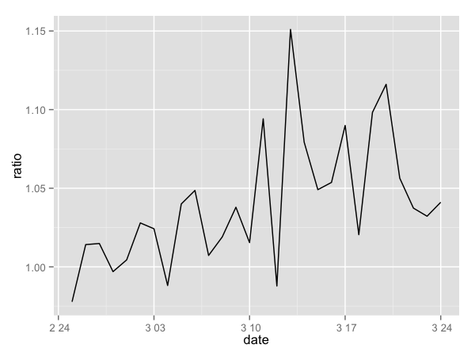
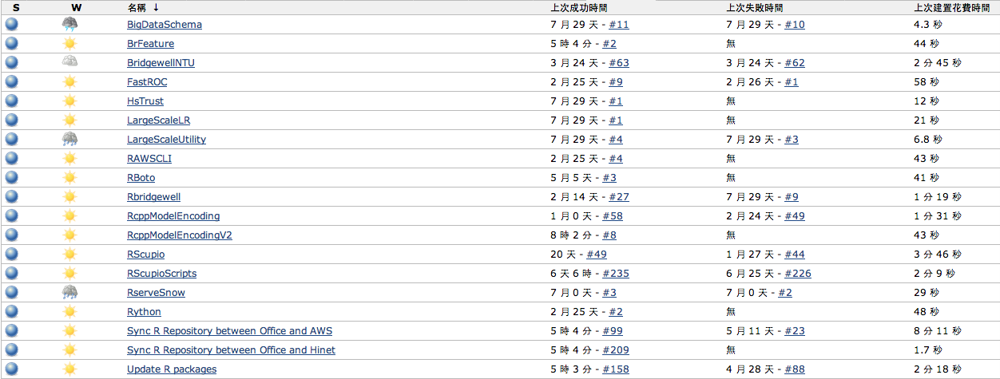

--- .dark .segue

## 不同的模型对预测会有影响吗？

--- &vcenter .large

因子的组合


--- &vcenter .large

实验结果

<!-- html table generated in R 3.0.3 by xtable 1.7-3 package -->
<!-- Sun May 25 00:30:10 2014 -->
<TABLE border=1>
<TR> <TH>  </TH> <TH> auc </TH> <TH> Regularization </TH> <TH> FeatureSet </TH> <TH> DayEffect </TH>  </TR>
  <TR> <TD align="right"> 1 </TD> <TD align="right"> 1.0394 </TD> <TD align="right">     1 </TD> <TD> A </TD> <TD> 09:00:00 </TD> </TR>
  <TR> <TD align="right"> 2 </TD> <TD align="right"> 1.0233 </TD> <TD align="right">    10 </TD> <TD> A </TD> <TD> 09:00:00 </TD> </TR>
  <TR> <TD align="right"> 3 </TD> <TD align="right"> 1.0181 </TD> <TD align="right">    20 </TD> <TD> A </TD> <TD> 09:00:00 </TD> </TR>
  <TR> <TD align="right"> 4 </TD> <TD align="right"> 1.0326 </TD> <TD align="right">     1 </TD> <TD> A </TD> <TD> 16:00:00 </TD> </TR>
  <TR> <TD align="right"> 5 </TD> <TD align="right"> 1.0196 </TD> <TD align="right">    10 </TD> <TD> A </TD> <TD> 16:00:00 </TD> </TR>
  <TR> <TD align="right"> 6 </TD> <TD align="right"> 1.0125 </TD> <TD align="right">    20 </TD> <TD> A </TD> <TD> 16:00:00 </TD> </TR>
  <TR> <TD align="right"> 7 </TD> <TD align="right"> 1.0174 </TD> <TD align="right">     1 </TD> <TD> A </TD> <TD> 20:00:00 </TD> </TR>
  <TR> <TD align="right"> 8 </TD> <TD align="right"> 1.0057 </TD> <TD align="right">    10 </TD> <TD> A </TD> <TD> 20:00:00 </TD> </TR>
  <TR> <TD align="right"> 9 </TD> <TD align="right"> 1.0000 </TD> <TD align="right">    20 </TD> <TD> A </TD> <TD> 20:00:00 </TD> </TR>
  <TR> <TD align="right"> 10 </TD> <TD align="right"> 1.0436 </TD> <TD align="right">     1 </TD> <TD> B </TD> <TD> 09:00:00 </TD> </TR>
  <TR> <TD align="right"> 11 </TD> <TD align="right"> 1.0277 </TD> <TD align="right">    10 </TD> <TD> B </TD> <TD> 09:00:00 </TD> </TR>
  <TR> <TD align="right"> 12 </TD> <TD align="right"> 1.0215 </TD> <TD align="right">    20 </TD> <TD> B </TD> <TD> 09:00:00 </TD> </TR>
  <TR> <TD align="right"> 13 </TD> <TD align="right"> 1.0406 </TD> <TD align="right">     1 </TD> <TD> B </TD> <TD> 16:00:00 </TD> </TR>
  <TR> <TD align="right"> 14 </TD> <TD align="right"> 1.0269 </TD> <TD align="right">    10 </TD> <TD> B </TD> <TD> 16:00:00 </TD> </TR>
  <TR> <TD align="right"> 15 </TD> <TD align="right"> 1.0203 </TD> <TD align="right">    20 </TD> <TD> B </TD> <TD> 16:00:00 </TD> </TR>
  <TR> <TD align="right"> 16 </TD> <TD align="right"> 1.0217 </TD> <TD align="right">     1 </TD> <TD> B </TD> <TD> 20:00:00 </TD> </TR>
  <TR> <TD align="right"> 17 </TD> <TD align="right"> 1.0088 </TD> <TD align="right">    10 </TD> <TD> B </TD> <TD> 20:00:00 </TD> </TR>
  <TR> <TD align="right"> 18 </TD> <TD align="right"> 1.0017 </TD> <TD align="right">    20 </TD> <TD> B </TD> <TD> 20:00:00 </TD> </TR>
   </TABLE>


--- &vcenter .large

分析

### 感谢R 强大的分析功能

<!-- html table generated in R 3.0.3 by xtable 1.7-3 package -->
<!-- Sun May 25 00:30:10 2014 -->
<TABLE border=1>
<TR> <TH>  </TH> <TH> row.names  Estimate </TH> <TH> Std. Error </TH> <TH> t value </TH> <TH> Pr(&gt;|t|) </TH>  </TR>
  <TR> <TD align="right"> (Intercept) </TD> <TD align="right"> 1.0343 </TD> <TD align="right"> 0.0009 </TD> <TD align="right"> 1165.2725 </TD> <TD align="right"> 0.0000 </TD> </TR>
  <TR> <TD align="right"> Regularization10 </TD> <TD align="right"> -0.0139 </TD> <TD align="right"> 0.0009 </TD> <TD align="right"> -15.6506 </TD> <TD align="right"> 0.0000 </TD> </TR>
  <TR> <TD align="right"> Regularization20 </TD> <TD align="right"> -0.0202 </TD> <TD align="right"> 0.0009 </TD> <TD align="right"> -22.7578 </TD> <TD align="right"> 0.0000 </TD> </TR>
  <TR> <TD align="right"> FeatureSetB </TD> <TD align="right"> 0.0049 </TD> <TD align="right"> 0.0007 </TD> <TD align="right"> 6.7933 </TD> <TD align="right"> 0.0000 </TD> </TR>
  <TR> <TD align="right"> DayEffect20:00 </TD> <TD align="right"> -0.0162 </TD> <TD align="right"> 0.0009 </TD> <TD align="right"> -18.2476 </TD> <TD align="right"> 0.0000 </TD> </TR>
  <TR> <TD align="right"> DayEffect9:00 </TD> <TD align="right"> 0.0035 </TD> <TD align="right"> 0.0009 </TD> <TD align="right"> 3.9816 </TD> <TD align="right"> 0.0018 </TD> </TR>
   </TABLE>


### 平均来说FeatureSet B 好 $0.5\%$

--- &vcenter .large


--- &vcenter .large

成果

<div class="rimage center"></div>


--- .dark .segue

## 其他的工程面分享

### 处理大量数据需要很多工程

--- &vcenter .large

R Packages + Git + Jenkins:

开发后自动测试、部署和版本控制



--- &vcenter .large

利用Spark做Data Cleaning


--- &vcenter .large

R + [rjson]() + [awscli](https://aws.amazon.com/cn/cli/)

自动利用AWS建立云端实验用Cluster


```r
ec2_request_spot_instances <- function(spot_price, instance_count, launch_specification = list()) {
  write(toJSON(launch_specification), file=(json.path <- tempfile()))
  cmd <- sprintf("aws ec2 request-spot-instances --spot-price %f --instance-count %d --launch-specification %s", spot_price, instance_count, sprintf("file://%s", json.path))
  system_collapse(cmd)
}
```


--- &vcenter .large

R 是可以对大量数据进行处理：

### 使用`Matrix`套件的稀疏矩阵
### `Rcpp`高效能的使用记忆体
### `Rcpp`整合第三方的库
### `pbdMPI`建立分散式平行运算丛集

--- &vcenter .large

关于今天分享的工作

感谢两位同学Y.-C. Juan, Y. Zhuang

和我在Bridgewell Inc.的合作

--- &vcenter .large

Q&A
